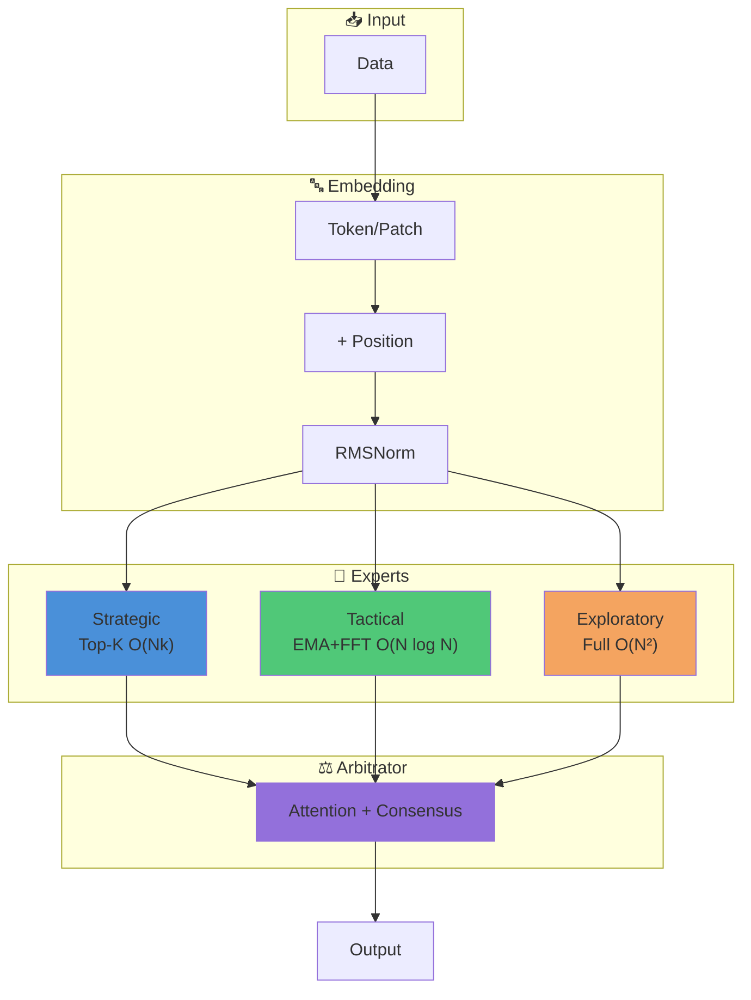

# COCOM v11: Complete Technical Guide

> **COCOM** — Consensus-based Committee of Mind  
> Expert ensemble architecture with arbitration

## Architecture



---

## 1. Architecture Overview

### 1.1 Core Concept

COCOM is an attention architecture inspired by cognitive science. Instead of a single monolithic attention mechanism, it uses a **committee of three specialized experts**, each with its own information processing strategy.

```
Input → Embedding → [Strategic, Tactical, Exploratory] → Arbitrator → Output
```

### 1.2 Why It Works

| Classic Transformer | COCOM v11 |
|---------------------|-----------|
| Single attention mechanism | 3 specialized experts |
| O(N²) for all tasks | Adaptive complexity |
| No consensus | Majority voting + arbitration |
| Single point of failure | Redundancy through experts |

### 1.3 Module Structure

```
cocom_11/
├── model.py           # Main COCOMv11 model
├── arbitrator.py      # Arbitrator
├── experts/
│   ├── strategic.py   # Sparse top-k attention
│   ├── tactical.py    # MultiScaleEMA + FFT
│   └── exploratory.py # Full attention
└── layers/
    ├── embeddings.py  # Patch, RoPE
    ├── normalization.py # RMSNorm
    ├── activations.py # SwiGLU
    └── sequential.py  # (legacy RWKV)
```

---

## 2. Expert System

### 2.1 Strategic Expert — Global Patterns

**Mechanism:** Sparse Top-K Attention

```python
# Select only top-k important positions for each query
scores = Q @ K.T / sqrt(d)
topk_vals, topk_idx = torch.topk(scores, k=int(N * 0.25))
sparse_attn = softmax(topk_vals)
```

**Why:**
- Focus on the most important positions in the sequence
- Reduces complexity from O(N²) to O(N × k)
- Effective for tasks with global dependencies
- Shows well when data is noisy, allowing risk-free additional data processing

**Parameters:**
- `top_k_ratio = 0.25` — fraction of positions to keep
- RoPE for position encoding
- SwiGLU FFN after attention

---

### 2.2 Tactical Expert — Sequential Dependencies

**Mechanism:** MultiScaleEMA with FFT Convolution

```python
# EMA via FFT — O(N log N)
kernel = exp(log(decay) * positions)
output = IFFT(FFT(x) * FFT(kernel))
```

**Why:**
- Exponentially decaying attention to past positions
- Multi-scale: different temporal dependency scales
- FFT for parallel computation
- If Tactical leads, consider moving away from transformers to newer architectures like S4, Mamba, etc.

**EMA Mathematics:**

`y[t] = α * x[t] + (1 - α) * y[t-1]`

This is equivalent to convolution with an exponential kernel, which can be computed via FFT.

**Parameters:**
- `n_scales = 4` — number of temporal scales
- Learnable: delta (decay), alpha, beta, omega

---

### 2.3 Exploratory Expert — Full Coverage

**Mechanism:** Full Global Attention

```python
scores = Q @ K.T / sqrt(d)
attn = softmax(scores)
output = attn @ V
```

**Why:**
- Guaranteed coverage of all positions
- Backup for cases when other experts fail
- Simplicity and reliability

**Parameters:**
- Standard Multi-Head Attention
- RoPE for positions
- SwiGLU FFN

---

### 2.4 Expert Comparison

| Expert | Complexity | Strengths | Weaknesses |
|--------|------------|-----------|------------|
| Strategic | O(N × k) | Global patterns, efficiency | May miss important info |
| Tactical | O(N log N) | Sequences, hierarchies | Cannot see "future" |
| Exploratory | O(N²) | Full coverage | Slow on long sequences |

---

## 3. Arbitrator

### 3.1 Mechanism

The Arbitrator makes decisions based on:
1. **Attention** on expert features + input context
2. **Confidence weighting** — confidence of each expert
3. **Own classifier** — arbitrator's own opinion

```python
# Attention on [input_context, feat_s, feat_t, feat_e]
attended = MultiHeadAttention(query, features)

# Confidence = 1 - normalized_entropy
confidence = 1 - entropy(softmax(logits)) / log(num_classes)

# Weighted combination
weights = softmax(attention_weights * confidence)
weighted_logits = sum(weights * expert_logits)

# Mix with own prediction
final = mix * weighted_logits + (1 - mix) * own_logits
```

### 3.2 Majority Voting Consensus

```python
# Check expert agreement
agree_st = (pred_s == pred_t)
agree_te = (pred_t == pred_e)
agree_se = (pred_s == pred_e)

# If 2+ agree — use their average
# Otherwise — arbitrator decides
```

**Why:**
- When experts agree, their opinion is more reliable
- Arbitrator steps in only during disagreements
- Reduces influence of one "noisy" expert

---

## 4. Layers and Optimizations

### 4.1 RMSNorm vs LayerNorm

**LayerNorm:**
`y = ((x - μ) / σ) * γ + β`

**RMSNorm:**
`y = (x / RMS(x)) * γ`

where `RMS(x) = sqrt(mean(x^2))`

**RMSNorm Advantages:**
- No mean computation
- ~10-15% faster
- Used in LLaMA, Mistral, Gemma

```python
class RMSNorm(nn.Module):
    def forward(self, x):
        rms = torch.rsqrt(x.pow(2).mean(-1, keepdim=True) + eps)
        return x * rms * self.weight
```

---

### 4.2 SwiGLU vs GELU

**GELU FFN:**
```python
FFN(x) = Linear2(GELU(Linear1(x)))
```

**SwiGLU FFN:**
```python
FFN(x) = Linear3(SiLU(Linear1(x)) * Linear2(x))
```

**SwiGLU Advantages:**
- Gating mechanism for adaptive activation
- Better quality with same parameter count
- Used in LLaMA, PaLM, Gemma

**Standard ratio:** hidden_dim = d_model × 8/3 ≈ 2.67x

---

### 4.3 RoPE — Rotary Position Embedding

**Problem:** Regular transformers simply add position vector to word vector (`x + pos`). In deep networks this information gets lost, and the model poorly understands distances between words.

**RoPE Solution (Rotation):**
Instead of addition, we **rotate** the token vector by an angle dependent on its position.
- Token at position 1 rotates 10°
- Token at position 2 rotates 20°
- ...
- Token at position 100 rotates 1000°

**How It Helps (Key Feature):**
Attention works as dot product (essentially measures angle between vectors).
- Difference (angle) between pos. 1 and 2 = **10°**
- Difference (angle) between pos. 100 and 101 = **10°**

**Result:** Network always **perfectly sees relative distance** between tokens. It doesn't matter where tokens are (beginning or end of text), only the shift between them matters.

```python
# Simplified logic
# (q * k) depends only on position difference (m - n)
score = dot(rotate(q, m), rotate(k, n)) == function(m - n)
```

**1D vs 2D:**
- **1D RoPE:** Rotate vector encoding 1 number (position in text)
- **2D RoPE:** (pathfinder) Split vector in half. Rotate one half encoding X coordinate, other encoding Y. This way network understands 2D image structure.

---

### 4.4 Embeddings

| Type | Usage | Implementation |
|------|-------|----------------|
| `tokens` | Discrete tokens (ListOps) | `nn.Embedding(vocab, d_model)` |
| `image` | 2D images | `Conv2d(1, d_model, patch_size, stride=patch_size)` |
| `image_conv1d` | 1D convolution on image | `Conv1d(1, d_model, kernel, stride=kernel)` |
| `continuous` | Continuous values | `nn.Linear(1, d_model)` |

---

## 5. Staged Training

### 5.1 Concept

Instead of training the entire model at once, train components sequentially:

```
Stage 1: Tactical + Embed (8 epochs)
    ↓
Stage 2: Strategic (5 epochs)
    ↓
Stage 3: Exploratory (5 epochs)
    ↓
Stage 4: Full model (20 epochs)
```

**Why:**
- Each expert learns its specialization
- Less interference between components
- Better convergence

### 5.2 Freeze/Unfreeze

```python
def freeze_all_except(self, parts: List[str]):
    # First freeze everything
    for param in self.parameters():
        param.requires_grad = False
    
    # Then unfreeze needed parts
    if 'tactical' in parts:
        for param in self.expert_tactical.parameters():
            param.requires_grad = True
```

### 5.3 Learning Rate Schedule

**OneCycleLR for Tactical stage:**
```python
scheduler = OneCycleLR(
    optimizer,
    max_lr=0.003,
    total_steps=total_steps,
    pct_start=0.15,        # 15% warmup
    anneal_strategy='cos', # Cosine decay
    div_factor=25,         # initial_lr = max_lr / 25
    final_div_factor=100   # final_lr = initial_lr / 100
)
```

**Constant LR for other stages:**
- Strategic: 0.001
- Exploratory: 0.001
- Full: 0.0003

---

## 6. Optimizer and Hyperparameters

### 6.1 AdamW

```python
optimizer = torch.optim.AdamW(
    params,
    lr=lr,
    betas=(0.9, 0.999),  # Standard for most cases
    eps=1e-8,
    weight_decay=0.01    # L2 regularization
)
```

**For Tactical stage:**
- `betas=(0.9, 0.98)` — less aggressive momentum
- Suitable for EMA-style training

### 6.2 Gradient Clipping

```python
torch.nn.utils.clip_grad_norm_(model.parameters(), max_norm=1.0)
```

**Why:** Prevents exploding gradients, especially important with FFT operations.

### 6.3 Mixed Precision (FP16)

```python
scaler = GradScaler()

with autocast():
    loss = model(x)

scaler.scale(loss).backward()
scaler.unscale_(optimizer)
clip_grad_norm_(...)
scaler.step(optimizer)
scaler.update()
```

**Advantages:**
- ~2x GPU speedup
- Less memory
- Quality preserved thanks to loss scaling

---

## 7. Architecture Summary

```
┌─────────────────────────────────────────────────────────┐
│                     COCOMv11                            │
├─────────────────────────────────────────────────────────┤
│  Input → Embedding → +pos_embed → RMSNorm              │
│                           ↓                             │
│     ┌─────────────────────┼─────────────────────┐      │
│     ↓                     ↓                     ↓      │
│ ┌─────────┐        ┌───────────┐        ┌───────────┐  │
│ │Strategic│        │  Tactical │        │Exploratory│  │
│ │ Top-K   │        │ EMA + FFT │        │   Full    │  │
│ │Attention│        │           │        │ Attention │  │
│ └────┬────┘        └─────┬─────┘        └─────┬─────┘  │
│      │                   │                    │        │
│      └─────────────────┬─┴────────────────────┘        │
│                        ↓                               │
│                  ┌───────────┐                         │
│                  │ Arbitrator│                         │
│                  │ Attention │                         │
│                  │+ Consensus│                         │
│                  └─────┬─────┘                         │
│                        ↓                               │
│                     Output                             │
└─────────────────────────────────────────────────────────┘
```

---

## 8. Model Parameters

| Component | Parameters (d=256) |
|-----------|-------------------|
| Embedding | ~525K |
| Strategic | ~790K |
| Tactical | ~960K |
| Exploratory | ~790K |
| Arbitrator | ~360K |
| **Total** | **~3.4M** |

---

## 9. Results

### ListOps (seq_len=2048, 10 classes)

| Stage | Test Accuracy |
|-------|---------------|
| Random baseline | 10% |
| After Tactical | ~35-40% |
| After Full | ~55-60% |

### Pathfinder-32 (seq_len=1024, 2 classes)

| Stage | Test Accuracy |
|-------|---------------|
| Random baseline | 50% |
| After Full | ~75-85% |

---

## 10. Quick Start

```python
from cocom_11 import COCOMv11

# For ListOps (sequential data)
model = COCOMv11(
    d_model=256,
    n_heads=8,
    num_classes=10,
    input_type='tokens',
    vocab_size=15,
    seq_len=2048,
    use_rope=True,
    rope_dims=1,  # 1D for sequences
)

# For Pathfinder (images)
model = COCOMv11(
    d_model=256,
    n_heads=8,
    num_classes=2,
    input_type='image',
    img_size=32,
    patch_size=4,
    use_rope=True,
    rope_dims=2,  # 2D for images
)

# Forward pass
logits, analysis = model(x)
```

---

## References

- **RMSNorm:** Zhang & Sennrich (2019) "Root Mean Square Layer Normalization"
- **SwiGLU:** Shazeer (2020) "GLU Variants Improve Transformer"
- **RoPE:** Su et al. (2021) "RoFormer: Enhanced Transformer with Rotary Position Embedding"
- **MEGA/EMA:** Ma et al. (2022) "Mega: Moving Average Equipped Gated Attention"
