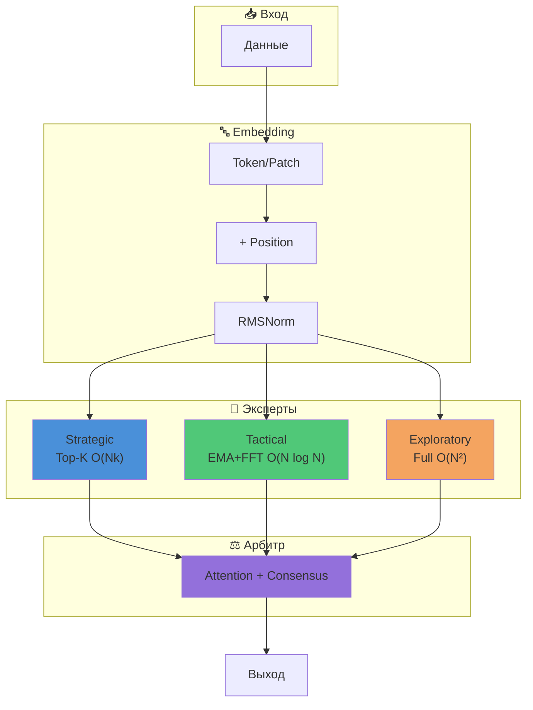

# COCOM v11: Полное техническое руководство

> **COCOM** — Consensus-based Committee of Mind  
> Архитектура на основе ансамбля экспертов с арбитрацией

## Архитектура



---

## 1. Обзор архитектуры

### 1.1 Основная концепция

COCOM — это архитектура внимания, вдохновлённая когнитивной наукой. Вместо одного монолитного механизма внимания используется **комитет из трёх специализированных экспертов**, каждый со своей стратегией обработки информации.

```
Вход → Embedding → [Strategic, Tactical, Exploratory] → Arbitrator → Выход
```

### 1.2 Почему это работает

| Классический Transformer | COCOM v11 |
|--------------------------|-----------|
| Один механизм внимания | 3 специализированных эксперта |
| O(N²) для всех задач | Адаптивная сложность |
| Нет консенсуса | Majority voting + арбитраж |
| Единая точка отказа | Резервирование через экспертов |

### 1.3 Структура модуля

```
cocom_11/
├── model.py           # Главная модель COCOMv11
├── arbitrator.py      # Арбитр
├── experts/
│   ├── strategic.py   # Sparse top-k attention
│   ├── tactical.py    # MultiScaleEMA + FFT
│   └── exploratory.py # Full attention
└── layers/
    ├── embeddings.py  # Patch, RoPE
    ├── normalization.py # RMSNorm
    ├── activations.py # SwiGLU
    └── sequential.py  # (legacy RWKV)
```

---

## 2. Система экспертов

### 2.1 Strategic Expert — Глобальные паттерны

**Механизм:** Sparse Top-K Attention

```python
# Выбираем только top-k важных позиций для каждого query
scores = Q @ K.T / sqrt(d)
topk_vals, topk_idx = torch.topk(scores, k=int(N * 0.25))
sparse_attn = softmax(topk_vals)
```

**Зачем:** 
- Фокус на самых важных позициях в последовательности
- Снижение сложности с O(N²) до O(N × k)
- Эффективен для задач с глобальными зависимостями
- Отлично показывает если данные зашумлены что позволяет без риска провести          дополнительную обработку данных

**Параметры:**
- `top_k_ratio = 0.25` — доля сохраняемых позиций
- RoPE для позиционного кодирования
- SwiGLU FFN после attention

---

### 2.2 Tactical Expert — Последовательные зависимости

**Механизм:** MultiScaleEMA с FFT Convolution

```python
# EMA через FFT — O(N log N)
kernel = exp(log(decay) * positions)
output = IFFT(FFT(x) * FFT(kernel))
```

**Зачем:**
- Экспоненциально затухающее внимание к прошлым позициям
- Multi-scale: разные масштабы временных зависимостей
- FFT для параллельных вычислений
- Если тактик ведёт то скорее всего стоит пресмотреться к уходу от трансформеров к более новым архитектурам типа s4 mamba и т.д.

**Математика EMA:**


`y[t] = α * x[t] + (1 - α) * y[t-1]`


Это эквивалентно свёртке с экспоненциальным ядром, что можно вычислить через FFT.

**Параметры:**
- `n_scales = 4` — количество временных масштабов
- Learnable: delta (decay), alpha, beta, omega

---

### 2.3 Exploratory Expert — Полное покрытие

**Механизм:** Full Global Attention

```python
scores = Q @ K.T / sqrt(d)
attn = softmax(scores)
output = attn @ V
```

**Зачем:**
- Гарантированное покрытие всех позиций
- Backup для случаев, когда другие эксперты не справляются
- Простота и надёжность

**Параметры:**
- Стандартный Multi-Head Attention
- RoPE для позиций
- SwiGLU FFN

---

### 2.4 Сравнение экспертов


| Эксперт | Сложность | Сильные стороны | Слабые стороны |
|---------|-----------|-----------------|----------------|
| Strategic | O(N × k) | Глобальные паттерны, эффективность | Может пропустить важное |
| Tactical | O(N log N) | Последовательности, иерархии | Не видит "будущее" |
| Exploratory | O(N²) | Полное покрытие | Медленно на длинных seq |

---

## 3. Арбитр (Arbitrator)

### 3.1 Механизм

Арбитр принимает решения на основе:
1. **Attention** на фичах экспертов + контексте входа
2. **Confidence weighting** — уверенность каждого эксперта
3. **Own classifier** — собственное мнение арбитра

```python
# Attention на [input_context, feat_s, feat_t, feat_e]
attended = MultiHeadAttention(query, features)

# Confidence = 1 - normalized_entropy
confidence = 1 - entropy(softmax(logits)) / log(num_classes)

# Weighted combination
weights = softmax(attention_weights * confidence)
weighted_logits = sum(weights * expert_logits)

# Mix with own prediction
final = mix * weighted_logits + (1 - mix) * own_logits
```

### 3.2 Majority Voting Consensus

```python
# Проверяем согласие экспертов
agree_st = (pred_s == pred_t)
agree_te = (pred_t == pred_e)
agree_se = (pred_s == pred_e)

# Если 2+ согласны — используем их среднее
# Иначе — решает арбитр
```

**Зачем:**
- Когда эксперты согласны, их мнение надёжнее
- Арбитр вступает только при разногласиях
- Снижает влияние одного "шумного" эксперта

---

## 4. Слои и оптимизации

### 4.1 RMSNorm vs LayerNorm

**LayerNorm:**


`y = ((x - μ) / σ) * γ + β`


**RMSNorm:**


`y = (x / RMS(x)) * γ`


где `RMS(x) = sqrt(mean(x^2))`

**Преимущества RMSNorm:**
- Нет вычисления среднего (mean)
- На ~10-15% быстрее
- Используется в LLaMA, Mistral, Gemma

```python
class RMSNorm(nn.Module):
    def forward(self, x):
        rms = torch.rsqrt(x.pow(2).mean(-1, keepdim=True) + eps)
        return x * rms * self.weight
```

---

### 4.2 SwiGLU vs GELU

**GELU FFN:**
```python
FFN(x) = Linear2(GELU(Linear1(x)))
```

**SwiGLU FFN:**
```python
FFN(x) = Linear3(SiLU(Linear1(x)) * Linear2(x))
```

**Преимущества SwiGLU:**
- Gating mechanism для адаптивной активации
- Лучше качество при том же числе параметров
- Используется в LLaMA, PaLM, Gemma

**Стандартный ratio:** hidden_dim = d_model × 8/3 ≈ 2.67x

---

### 4.3 RoPE — Rotary Position Embedding

**Проблема:** Обычные трансформеры просто добавляют вектор позиции к вектору слова (`x + pos`). В глубоких сетях эта информация теряется ("замыливается"), и модель плохо понимает расстояния между словами.

**Решение RoPE (Вращение):**
Вместо сложения, мы **вращаем** вектор токена на угол, зависящий от его позиции.
- Токен на позиции 1 поворачивается на 10°.
- Токен на позиции 2 поворачивается на 20°.
- ...
- Токен на позиции 100 поворачивается на 1000°.

**Как это помогает (Главная фишка):**
Механизм Attention работает как скалярное произведение (по сути, измеряет угол между векторами).
- Разница (угол) между поз. 1 и 2 = **10°**.
- Разница (угол) между поз. 100 и 101 = **10°**.

**Результат:** Сеть всегда **идеально видит относительное расстояние** между токенами. Ей не важно, где находятся токены (в начале или в конце текста), важен только сдвиг между ними. Тогда как в обычных методах это свойство не гарантируется.

```python
# Упрощенная логика
# (q * k) зависит только от разницы позиций (m - n)
score = dot(rotate(q, m), rotate(k, n)) == function(m - n)
```

**1D vs 2D:**
- **1D RoPE:** Вращаем вектор, кодируя 1 число (позицию в тексте).
- **2D RoPE:** (pathfinder) Делим вектор пополам. Одну половину вращаем кодируя координату X, вторую — Y. Так сеть понимает двумерную структуру картинки.

---

### 4.4 Embeddings

| Тип | Использование | Реализация |
|-----|---------------|------------|
| `tokens` | Дискретные токены (ListOps) | `nn.Embedding(vocab, d_model)` |
| `image` | 2D изображения | `Conv2d(1, d_model, patch_size, stride=patch_size)` |
| `image_conv1d` | 1D свёртка по изображению | `Conv1d(1, d_model, kernel, stride=kernel)` |
| `continuous` | Непрерывные значения | `nn.Linear(1, d_model)` |

---

## 5. Staged Training

### 5.1 Концепция

Вместо обучения всей модели сразу, обучаем компоненты по очереди:

```
Stage 1: Tactical + Embed (8 epochs)
    ↓
Stage 2: Strategic (5 epochs)
    ↓
Stage 3: Exploratory (5 epochs)
    ↓
Stage 4: Full model (20 epochs)
```

**Зачем:**
- Каждый эксперт учится своей специализации
- Меньше интерференции между компонентами
- Лучшая сходимость

### 5.2 Freeze/Unfreeze

```python
def freeze_all_except(self, parts: List[str]):
    # Сначала замораживаем всё
    for param in self.parameters():
        param.requires_grad = False
    
    # Потом размораживаем нужные части
    if 'tactical' in parts:
        for param in self.expert_tactical.parameters():
            param.requires_grad = True
```

### 5.3 Learning Rate Schedule

**OneCycleLR для Tactical stage:**
```python
scheduler = OneCycleLR(
    optimizer,
    max_lr=0.003,
    total_steps=total_steps,
    pct_start=0.15,        # 15% warmup
    anneal_strategy='cos', # Cosine decay
    div_factor=25,         # initial_lr = max_lr / 25
    final_div_factor=100   # final_lr = initial_lr / 100
)
```

**Constant LR для других stages:**
- Strategic: 0.001
- Exploratory: 0.001
- Full: 0.0003

---

## 6. Оптимизатор и гиперпараметры

### 6.1 AdamW

```python
optimizer = torch.optim.AdamW(
    params,
    lr=lr,
    betas=(0.9, 0.999),  # Стандартные для большинства
    eps=1e-8,
    weight_decay=0.01    # L2 regularization
)
```

**Для Tactical stage:**
- `betas=(0.9, 0.98)` — менее агрессивный momentum
- Подходит для EMA-style обучения

### 6.2 Gradient Clipping

```python
torch.nn.utils.clip_grad_norm_(model.parameters(), max_norm=1.0)
```

**Зачем:** Предотвращение exploding gradients, особенно важно при FFT операциях.

### 6.3 Mixed Precision (FP16)

```python
scaler = GradScaler()

with autocast():
    loss = model(x)

scaler.scale(loss).backward()
scaler.unscale_(optimizer)
clip_grad_norm_(...)
scaler.step(optimizer)
scaler.update()
```

**Преимущества:**
- ~2x ускорение на GPU
- Меньше памяти
- Качество сохраняется благодаря loss scaling

---

## 7. Сводка архитектуры

```
┌─────────────────────────────────────────────────────────┐
│                     COCOMv11                            │
├─────────────────────────────────────────────────────────┤
│  Input → Embedding → +pos_embed → RMSNorm              │
│                           ↓                             │
│     ┌─────────────────────┼─────────────────────┐      │
│     ↓                     ↓                     ↓      │
│ ┌─────────┐        ┌───────────┐        ┌───────────┐  │
│ │Strategic│        │  Tactical │        │Exploratory│  │
│ │ Top-K   │        │ EMA + FFT │        │   Full    │  │
│ │Attention│        │           │        │ Attention │  │
│ └────┬────┘        └─────┬─────┘        └─────┬─────┘  │
│      │                   │                    │        │
│      └─────────────────┬─┴────────────────────┘        │
│                        ↓                               │
│                  ┌───────────┐                         │
│                  │ Arbitrator│                         │
│                  │ Attention │                         │
│                  │+ Consensus│                         │
│                  └─────┬─────┘                         │
│                        ↓                               │
│                     Output                             │
└─────────────────────────────────────────────────────────┘
```

---

## 8. Параметры модели

| Компонент | Параметры (d=256) |
|-----------|-------------------|
| Embedding | ~525K |
| Strategic | ~790K |
| Tactical | ~960K |
| Exploratory | ~790K |
| Arbitrator | ~360K |
| **Всего** | **~3.4M** |

---

## 9. Результаты

### ListOps (seq_len=2048, 10 классов)

| Stage | Test Accuracy |
|-------|---------------|
| Random baseline | 10% |
| After Tactical | ~35-40% |
| After Full | ~55-60% |

### Pathfinder-32 (seq_len=1024, 2 класса)

| Stage | Test Accuracy |
|-------|---------------|
| Random baseline | 50% |
| After Full | ~75-85% |

---

## 10. Быстрый старт

```python
from cocom_11 import COCOMv11

# Для ListOps (последовательные данные)
model = COCOMv11(
    d_model=256,
    n_heads=8,
    num_classes=10,
    input_type='tokens',
    vocab_size=15,
    seq_len=2048,
    use_rope=True,
    rope_dims=1,  # 1D для последовательностей
)

# Для Pathfinder (изображения)
model = COCOMv11(
    d_model=256,
    n_heads=8,
    num_classes=2,
    input_type='image',
    img_size=32,
    patch_size=4,
    use_rope=True,
    rope_dims=2,  # 2D для изображений
)

# Forward pass
logits, analysis = model(x)
```

---

## Ссылки

- **RMSNorm:** Zhang & Sennrich (2019) "Root Mean Square Layer Normalization"
- **SwiGLU:** Shazeer (2020) "GLU Variants Improve Transformer"
- **RoPE:** Su et al. (2021) "RoFormer: Enhanced Transformer with Rotary Position Embedding"
- **MEGA/EMA:** Ma et al. (2022) "Mega: Moving Average Equipped Gated Attention"
